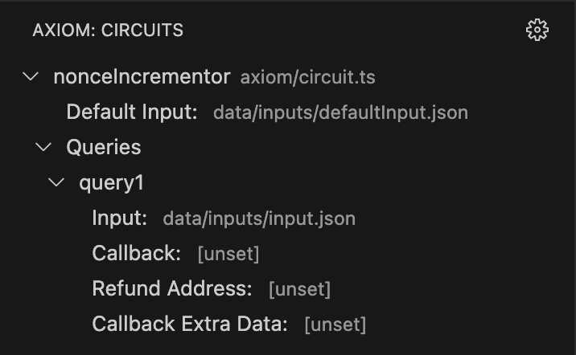
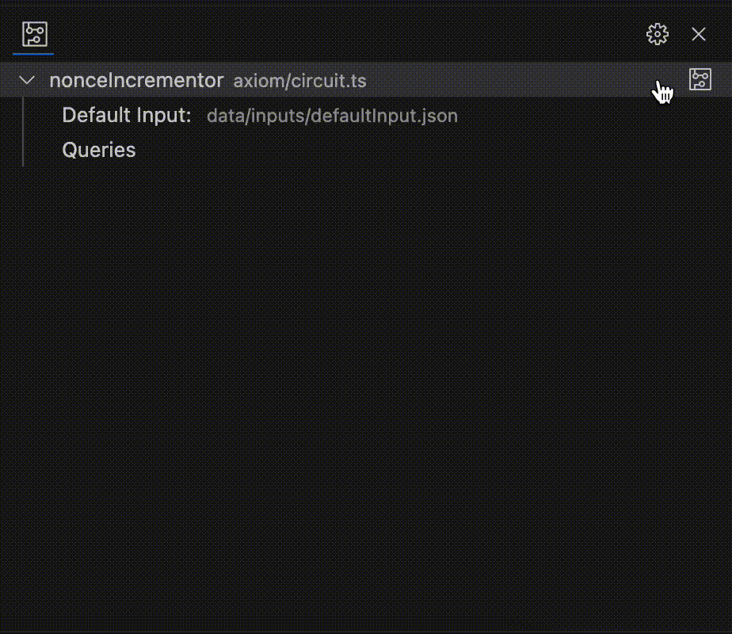
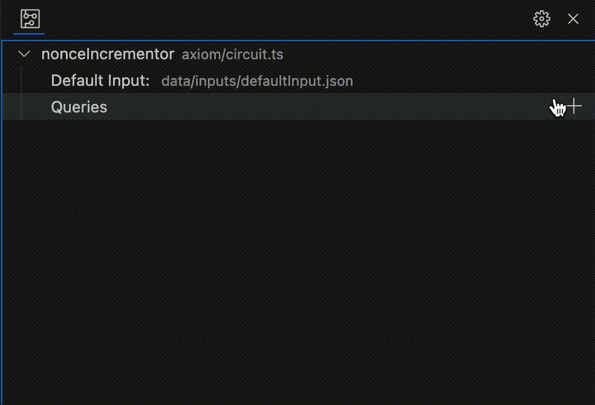
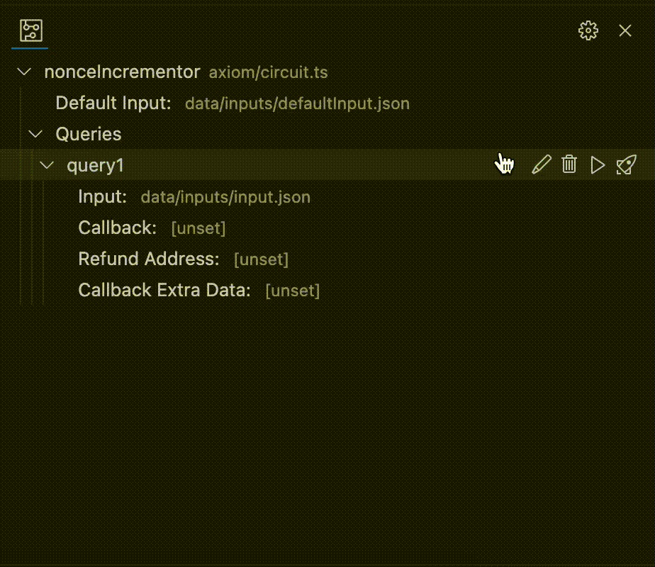
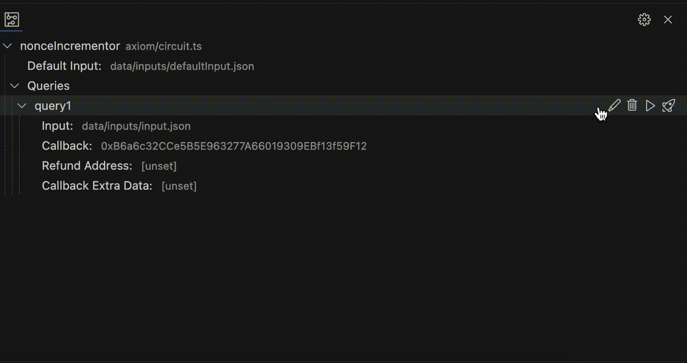

# Axiom-VScode

A VS code extension for testing, running and sending [Axiom](https://www.axiom.xyz/) circuits and queries.

## Features

Axiom-VScode offers a user-friendly view for managing your Axiom circuit and its queries. 

### Managing Circuits

Circuits are loaded from a specified location using a customizable glob pattern in the [extension settings](#extension-settings)
. The circuit name is extracted from the circuit file.



#### Compile a Circuit

Compilation requires that the default input be set. 

The output will be written to the directory set in the [extension settings](#extension-settings)


### Managing Queries

Queries are managed by Axiom-VScode and saved to the VScode workspace state. 

#### Add a query


#### Run a query

You must compile the circuit and set the query input before running.

You must also set `PROVIDER_URI_GOERLI` in the config file defined in the [extension settings](#extension-settings)



#### Sending a query

You must run the query and set the refund address before sending.

You must also set `PRIVATE_KEY_GOERLI` in the config file defined in the [extension settings](#extension-settings)



## Setup

```
# install dependencies
yarn install
# typescript compile
yarn compile
```

## Running the Extension

Run the extension by using the `Run and Debug` tab in VS code. This will create a new VS code window where you can open a new workspace folder. Use the [axiom-quickstart](https://github.com/axiom-crypto/axiom-quickstart) project for testing.

Note: You may need to run `yarn recompile` for changes to reflect.

## Extension Settings

This extension contributes the following settings:

* `axiom.configFilePath`: File in which PRIVATE_KEY_GOERLI and PROVIDER_URI_GOERLI are defined. Default is `.env`.
* `axiom.circuitFilesPattern`: Glob pattern to used to automatically discover files containing circuit definitions. Default is `**/axiom/**/*.ts`.
* `axiom.buildDirectory`: Path where circuit outputs from compiled circuits will be written. Default is `build/axiom`.
